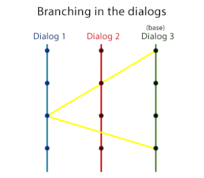

# TDW Dialogs

### About the library
Dialogs!

### Installation
1. Download library.
2. All files move into folder `pawno/includes`. But, you can use the flag `-i<path>` to specify an alternative path.
3. Include it:
```PAWN
#include <a_samp> // standart SAMP library
#include <tdw_dialog>
```

### Example:
```pawn
#include <a_samp>
#include <tdw_dialog>


dialog RegisterPlayerDialog(playerid, response, inputtext[])
{
	if (response) {
		SendClientMessage(playerid, -1,
			!"Ок!"
		);
	} else {
		Dialog_Show(playerid, dfunc:RegisterPlayerDialog);
	}
	return 1;
}

dtempl RegisterPlayerDialog(playerid)
{
	const SOME_STRING = 50;
	static buffer[SOME_STRING];
	GetPlayerName(playerid, buffer, MAX_PLAYER_NAME + 1);
	format(buffer, sizeof buffer, "Hello! %s", buffer);
	Dialog_Open(playerid, dfunc:RegisterPlayerDialog, DIALOG_STYLE_INPUT,
		buffer, !"Ok? or not?",
		!"Ok!", !"No!"
	);
	return 1;
}


public
	OnPlayerConnect(playerid)
{
	Dialog_Show(playerid, dfunc:RegisterPlayerDialog);
	return 1;
}
```

### Branching

#
